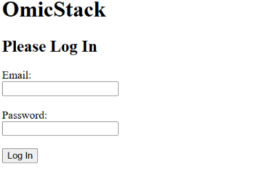
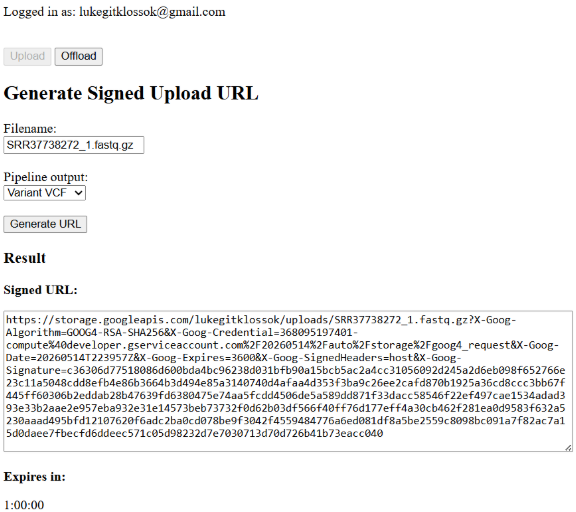
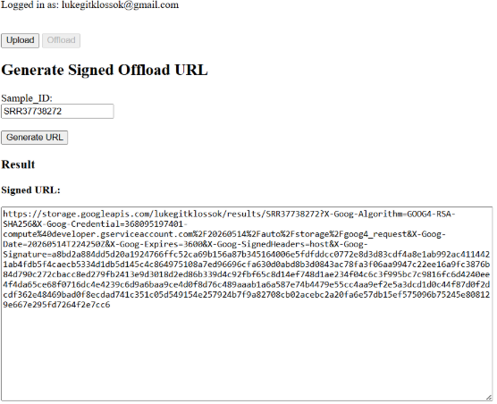
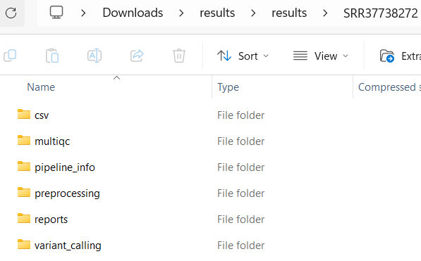
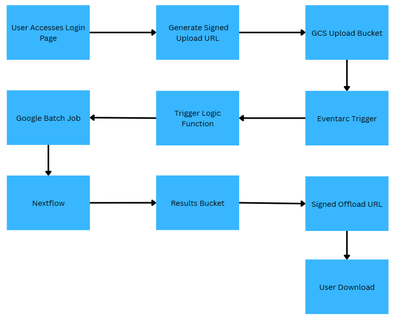

# OmicStack Prebuild

### _Ongoing project designing an interoperable, standardized, FASTQ/BAM-to-MAF automated pipeline using Google Cloud Platform_  
In its current build, the pipeline is set up to process files from FASTQ to VEP-annotated VCF files.

## Front-End Development

### Login
User accounts are managed manually by an administrator. To request access, please contact admin for account creation.  

Authentication is implemented using secure email/password login with credentials managed through Google Cloud Secret Manager. Each user is given their own designated cloud storage bucket.
 
 

### File Upload Architecture
Large FASTQ files are uploaded using signed URLs generated through Google Cloud Run and stored directly in Google Cloud Storage.

Instead of routing multi-GB uploads through the web application, the backend generates a temporary signed URL that allows the client to upload files securely and directly to the storage bucket. This avoids Cloud Run request size limitations, improves upload reliability, and reduces backend bandwidth usage.

- Handles large genomic files more reliably
- Reduces server load and transfer bottlenecks
- Uses temporary, time-limited upload permissions
- HTTPS/TLS handled automatically by Cloud Run

### File Offload Architecture
Pipeline outputs are packaged into compressed ZIP archives containing all generated result files, pipeline metadata, and run information (e.g. timestamps and workflow details).

The ZIP folder offload is delivered using signed URLs similar to the upload process generated through Google Cloud Run. Like the FASTQ uploads, files are transferred directly between the client and cloud storage rather than through the web application, improving reliability and reducing backend bandwidth usage.

 
  

## Back-End Infrastructure 
The back-end infrastructure is built using containerized services, event-driven triggers, and scalable batch compute resources for automated processing.
 
 

### Google Batch Pipeline Execution
Uploaded FASTQ files automatically trigger pipeline execution through Google Cloud event listeners and batch compute jobs.

Once paired FASTQ files are detected in cloud storage, metadata associated with the upload is validated and a containerized nf-core/Sarek workflow is submitted to Google Cloud Batch for processing.
- Automated FASTQ pair detection
- Event-driven workflow triggering
- Dynamic batch job provisioning
- Containerized reproducible pipeline execution
- Scalable compute allocation for large sequencing datasets 

### Containerized Workflow Infrastructure
Pipeline execution is fully containerized using Docker images stored in Google Artifact Registry. Workflow orchestration is managed through Nextflow with Google Batch as the execution backend.
- Reproducible runtime environments
- Portable workflow execution
- Version-controlled pipeline containers

### Metadata & Job Tracking
Each upload generates associated JSON metadata stored alongside the sequencing files in cloud storage. Metadata tracks pipeline configuration, job status, timestamps, and downstream processing information.
- Upload-associated job metadata
- Pipeline endpoint selection tracking
- Batch job status monitoring

### Google Cloud API's Utilized
The current platform integrates multiple Google Cloud services for authentication, storage, compute orchestration, and scalable workflow execution.

Core services include:
- Google Cloud Run
- Google Cloud Storage
- Google Cloud Batch
- Google Artifact Registry
- Google Eventarc
- Google Secret Manager
- Docker
- Nextflow / nf-core Sarek 

### Back-End Graphical Overview

 
  

## Next Steps
Currently focused on expanding pipeline flexibility, improving variant interpretation, and scaling compute orchestration *before* I explore MAF file outputs.

Ongoing Additions:
- Integration of additional somatic variant callers such as Strelka alongside the current Mutect2 workflow
- Support for direct BAM file inputs in addition to FASTQ uploads
- Development of a downstream variant annotation pipeline using bcftools for incorporation of:
  - gnomAD population frequencies
  - ClinVar clinical annotations
  - COSMIC somatic cancer mutation data
- Development of tumor-specific workflow configuration files to enable cancer-type aware filtering of somatic variants, including optional user-provided gene panels for targeted prioritization
- Transition from Google Cloud Batch toward Kubernetes-based orchestration for improved scalability, scheduling flexibility, and long-term infrastructure management
